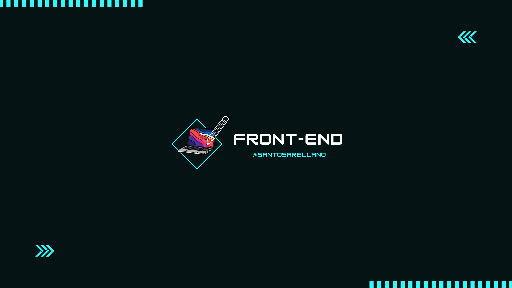

	

	
        
	

	

## 👨🏻‍💻 &nbsp;About Me:

👋 &nbsp;Hi there! I'm Santos Arellano, a web developer currently studying Computer Science at Monterrey Institute of Technology and Higher Education.

🔍 &nbsp;I'm also a member of Solana Collective, passionate about web development and exploring innovative technologies.

🚀 &nbsp;My technical skills include C++, JavaScript, python, and more, and I'm dedicated to leveraging these skills to create impactful web projects.

🌱 &nbsp;Currently, I'm focused on advancing my knowledge in the field of web development and diving deeper into cutting-edge technologies.

💼 &nbsp;I have a strong foundation in front-end and back-end web development, having worked on projects ranging from e-commerce websites to interactive web applications. I'm eager to contribute my skills and creativity to the tech community, collaborating on projects that make a positive impact.

📄 &nbsp;For more details about my experience and skills, please check out my <a href="Professional Resume.pdf">Resume</a>

🤝 &nbsp;I'm open to new opportunities and collaborations, so feel free to connect with me!

  <h3>✍️ Random Dev Quote</h3>
  

###  Frontend Development

 
  &emsp; 
     
  &emsp;
   
  &emsp;
   
  &emsp;

  
  &emsp;
  
  &nbsp;
  &nbsp;
  &nbsp;
  
  
  

###  Backend Development
&nbsp;
&nbsp;
&nbsp;

###  Databases & Cloud Hosting

  &emsp;
    
  &emsp;
    
  &emsp;
      
    &emsp;
       
    &emsp;
      
 &emsp; 

&nbsp;
  
### Graphic design

	
 &nbsp;
	
    
  &emsp;
   
    &emsp;
  
    &emsp;
  
&emsp; 
 

### Mobile App

	&emsp; 
 
 

### Others

&nbsp;

&nbsp;
&nbsp;

## 👨‍🚀 Upcoming Learning

I plan to learn the following technologies soon:

	 
	&emsp; 

  &emsp;
   
  &emsp;
   
&emsp;
 
&emsp;
  
   &emsp;

&nbsp;

## 📈 Statistics

 

  
      

