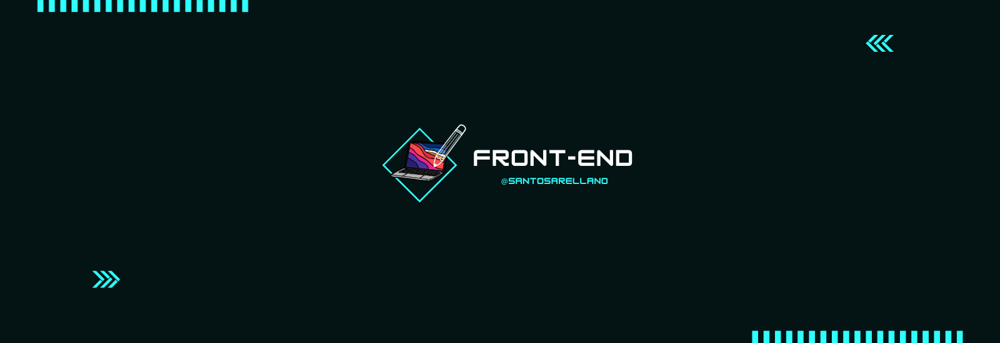

	

	
        
	

	

## 👨🏻‍💻 &nbsp;About Me:

👋 &nbsp;Hi there! I'm Santos Arellano, a web developer currently studying Computer Science at Monterrey Institute of Technology and Higher Education.

🔠&nbsp;I'm also a member of Solana Collective, passionate about web development and exploring innovative technologies.

🚀 &nbsp;My technical skills include C++, JavaScript, python, and more, and I'm dedicated to leveraging these skills to create impactful web projects.

🌱 &nbsp;Currently, I'm focused on advancing my knowledge in the field of web development and diving deeper into cutting-edge technologies.

💼 &nbsp;I have a strong foundation in front-end and back-end web development, having worked on projects ranging from e-commerce websites to interactive web applications. I'm eager to contribute my skills and creativity to the tech community, collaborating on projects that make a positive impact.

📄 &nbsp;For more details about my experience and skills, please check out my <a href="Professional Resume.pdf">Resume</a>

🤠&nbsp;I'm open to new opportunities and collaborations, so feel free to connect with me!

 

## 🛠 &nbsp;Tech Stack:

### 💻 &nbsp;Languages:

&nbsp;
&nbsp;
&nbsp;
&nbsp;
&nbsp;
&nbsp;
&nbsp;

### 🚀 &nbsp;Technologies:

&nbsp;
&nbsp;
&nbsp;
&nbsp;
&nbsp;

## 📈 Statistics

 

  
      

